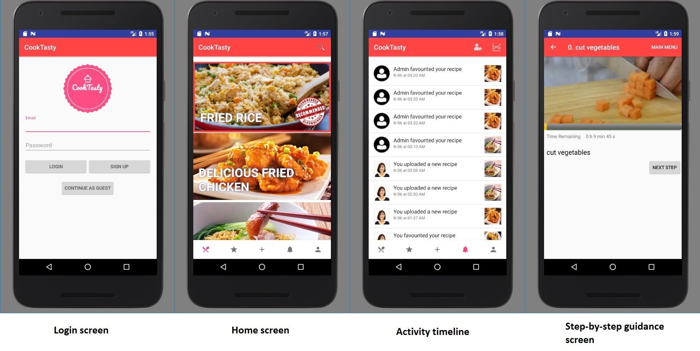

# CookTasty :spaghetti:

CookTasty is a mobile app developed to help amateur chefs learn to cook. As the app is a server sided application, the app can only be access with an internet connection. The code to the backend can be found [here](https://github.com/sohjunjie/the7chefs_backend).

## School project :school:
The app is developed for the NTU CZ3002 Advanced Software Engineering Group Project.

## Key features

#### 1. Recipe recommendation
The app is able provide recipe recommendation to users. For now the recommendation algorithm generates a random recipe not belong to the user.

#### 2. Step-by-step cooking guide
The app provide a step by step guide by incorporating a timer into each cooking step. This allow user to gauge their cooking precision in terms of timing so that they do not under or over cook.

#### 3. User activity timeline
The app provides an activity timeline of the user. User will be able to see from the timeline who followed the user or favourited the user recipe.

## Sample screens

